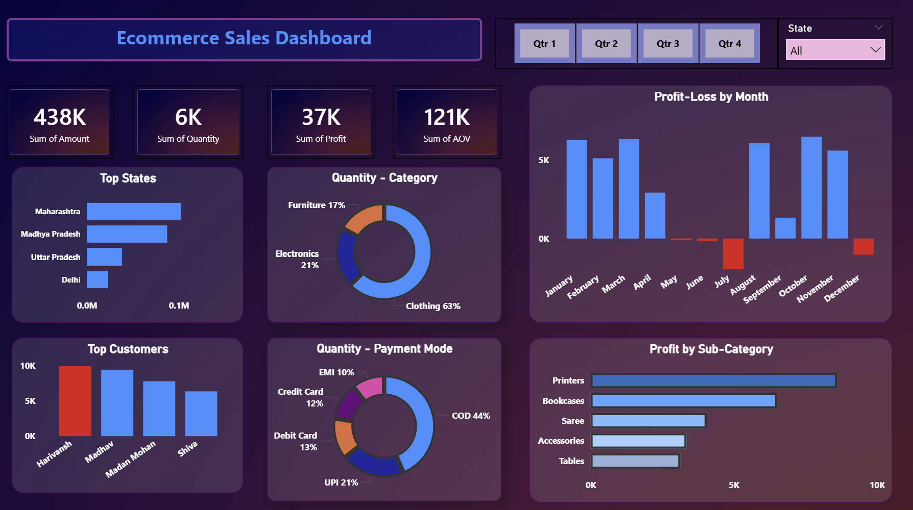
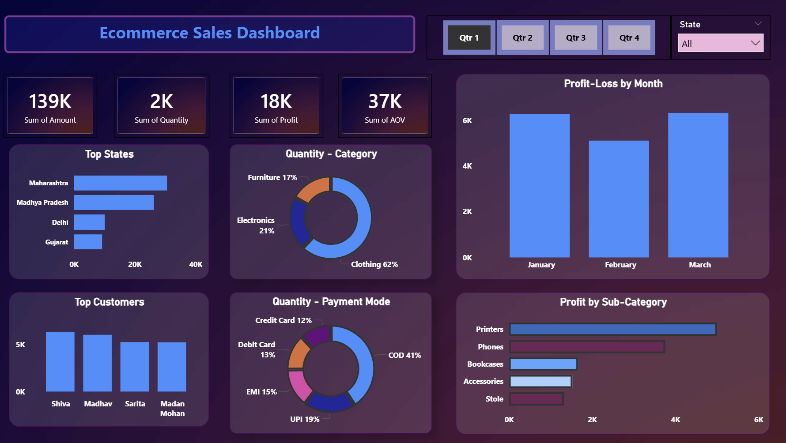
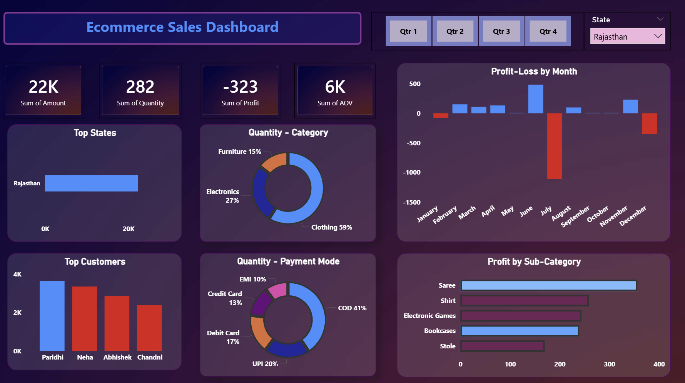

# Ecommerce Sales Analysis Dashboard (Power BI)

## Project Overview

This project focuses on analyzing online sales data of **Madhav Store**, an e-commerce business operating across India. The objective of this project is to create an interactive Power BI dashboard that helps business owners monitor sales performance, profitability, customer behavior, product trends, and payment preferences.

The dashboard enables users to filter data dynamically using slicers and gain valuable insights for business decision-making.

---

## Business Problem

The owner of Madhav Store wants to track and analyze online sales performance across different states of India. The goal is to identify:

* High-performing states
* Most valuable customers
* Best-selling product categories
* Profitable sub-categories
* Popular payment methods
* Monthly profit trends

To address these requirements, an interactive Power BI dashboard was developed.

---

## Dataset Information

The project uses two CSV files.

### 1. Orders Table

Contains customer and location information.

| Column Name   |
| ------------- |
| Order ID      |
| Order Date    |
| Customer Name |
| State         |
| City          |

#### Sample Data

| Order ID | Order Date | Customer Name | State         | City    |
| -------- | ---------- | ------------- | ------------- | ------- |
| B-26055  | 10/3/2018  | Harivansh     | Uttar Pradesh | Mathura |
| B-25993  | 3/2/2018   | Madhav        | Delhi         | Delhi   |

---

### 2. Details Table

Contains transaction and product information.

| Column Name  |
| ------------ |
| Order ID     |
| Amount       |
| Profit       |
| Quantity     |
| Category     |
| Sub-Category |
| Payment Mode |

#### Sample Data

| Order ID | Amount | Profit | Quantity | Category    | Sub-Category     | Payment Mode |
| -------- | ------ | ------ | -------- | ----------- | ---------------- | ------------ |
| B-25681  | 1096   | 658    | 7        | Electronics | Electronic Games | COD          |
| B-26055  | 5729   | 64     | 14       | Furniture   | Chairs           | EMI          |
| B-25955  | 2927   | 146    | 8        | Furniture   | Bookcases        | EMI          |
| B-26093  | 2847   | 712    | 8        | Electronics | Printers         | Credit Card  |

---

## Data Modeling

The two datasets were connected using the **Order ID** column.

### Relationship

Orders Table (1) → (*) Details Table

This relationship enables analysis of customer, location, and sales information together.

---

## Data Preparation

The following data preparation steps were performed:

* Imported CSV files into Power BI
* Established relationship using Order ID
* Verified data types
* Created Quarter information from Order Date
* Added an AOV (Average Order Value) measure for analysis
* Cleaned and validated the data

---

## Key Performance Indicators (KPIs)

The dashboard includes four KPI cards:

### 1. Total Sales Amount

Displays the total revenue generated from all orders.

### 2. Total Profit

Displays overall profit earned.

### 3. Total Quantity Sold

Displays the total number of products sold.

### 4. Average Order Value (AOV)

Displays the average value generated per order.

---

## Dashboard Features

### Interactive Slicers

Two slicers were added to enable dynamic filtering:

* Quarter Filter (Qtr 1 – Qtr 4)
* State Filter

Users can instantly analyze sales performance for specific quarters and states.

---

## Visualizations

### 1. Profit/Loss by Month (Column Chart)

Shows monthly profit performance and highlights profitable and low-performing months.

### 2. Profit by Sub-Category (Bar Chart)

Displays profit generated by each product sub-category and helps identify the most profitable products.

### 3. Top States by Sales Amount (Bar Chart)

Ranks states according to total sales revenue.

### 4. Top Customers (Column Chart)

Highlights customers contributing the highest sales.

### 5. Category-wise Quantity Sold (Donut Chart)

Shows distribution of sold quantities across different product categories.

### 6. Payment Mode by Quantity (Donut Chart)

Displays customer payment preferences such as:

* COD
* Credit Card
* Debit Card
* EMI
* UPI

---

## Business Insights

The dashboard helps answer important business questions such as:

* Which states generate the highest revenue?
* Which customers contribute most to sales?
* Which product sub-categories generate maximum profit?
* Which months are most profitable?
* Which payment methods are preferred by customers?
* Which product categories sell the most units?

---

## Dashboard Screenshots

### Main Dashboard

---

### Dashboard Filtered by Quarter (Qtr 1)

---

### Dashboard Filtered by State

---

## Tools Used

* Microsoft Power BI
* Power Query
* DAX
* CSV Dataset

---

## Project Outcomes

* Built a fully interactive sales analytics dashboard.
* Implemented dynamic filtering using slicers.
* Performed sales, profit, customer, and category analysis.
* Generated actionable business insights through visualizations.
* Improved decision-making capability through real-time data exploration.

---

## Conclusion

This Ecommerce Sales Analysis Dashboard provides a comprehensive view of Madhav Store's online sales performance across India. Through interactive visualizations and KPI tracking, the dashboard enables efficient monitoring of revenue, profit, customer behavior, product performance, and payment trends, helping business owners make data-driven decisions.

---

## Author

**Omar Faruque Chowdhury**

PowerBI Data Analysis Project – Sales Dashboard Development

**Inspired by Rishabh Mishra**
